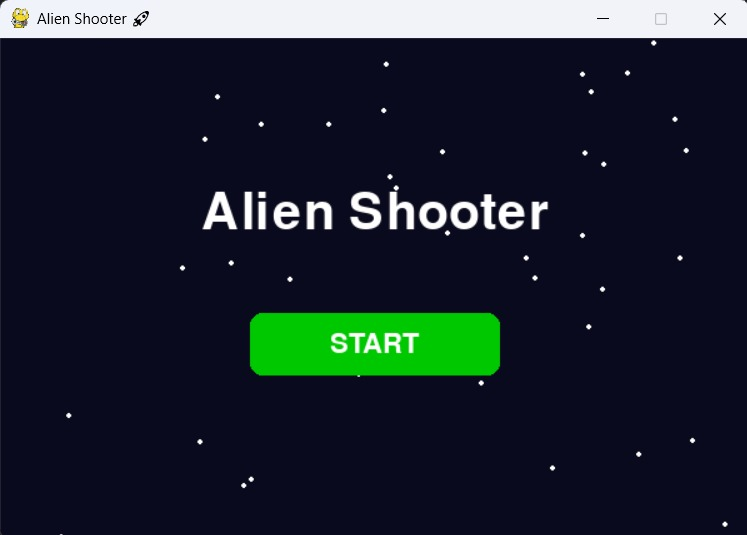
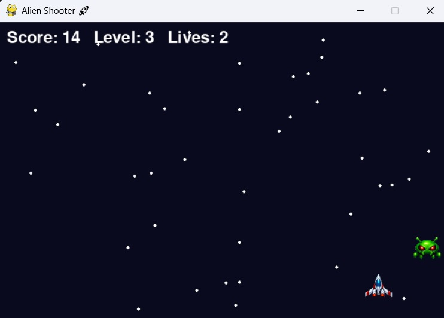
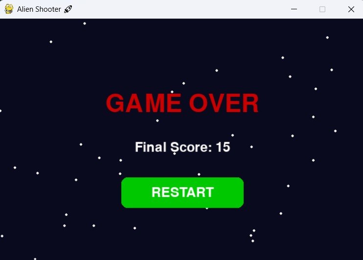

# 👾 Alien Shooter Game 🚀

A 2D space shooting game built using **Python** and **Pygame**.
In this game, the player controls a spaceship, shoots bullets to destroy aliens, earns points, progresses through levels, and tries to survive with limited lives.

---

# 📌 Project Overview

**Alien Shooter** is a beginner-friendly Python game project created using the **Pygame** library.

The main objective of the game is to:

* Move the spaceship
* Shoot enemies
* Increase the score
* Progress through levels
* Survive without losing all lives

This project helped me understand game development concepts such as:

* Game Loop
* Player Movement
* Enemy Movement
* Bullet Firing
* Collision Detection
* Score Tracking
* Level Progression
* Game Over Logic

---

# ✨ Features

* 🚀 Spaceship Movement
* 👾 Alien Enemy System
* 🔫 Bullet Shooting System
* 🎯 Collision Detection
* 🧮 Score Tracking
* 📈 Level Progression
* ❤️ Lives System
* 💀 Game Over Screen
* 🎮 Simple Keyboard Controls
* 🖼️ Start, Gameplay, and Game Over Screens

---

# 🧠 Game Logic

The game follows a simple 2D shooting logic:

1. The player controls a spaceship using the keyboard.
2. Aliens appear on the screen as enemies.
3. The player shoots bullets using the spacebar.
4. When a bullet hits an alien, the score increases.
5. After reaching certain score points, the level increases.
6. As the level increases, the game becomes more challenging.
7. The player has limited lives.
8. If the player loses all lives, the game ends and the Game Over screen is displayed.

---

# 🛠️ Technologies Used

* Python
* Pygame

---

# 🎮 Controls

| Key            | Action               |
| -------------- | -------------------- |
| ⬅️ Left Arrow  | Move Spaceship Left  |
| ➡️ Right Arrow | Move Spaceship Right |
| Spacebar       | Shoot Bullet         |

---

# 🖼️ Screenshots

## 🚀 Start Screen

---

## 🎮 Gameplay

---

## 💀 Game Over Screen

## Screenshots

### Start Screen

### Gameplay

### Game Over Screen

